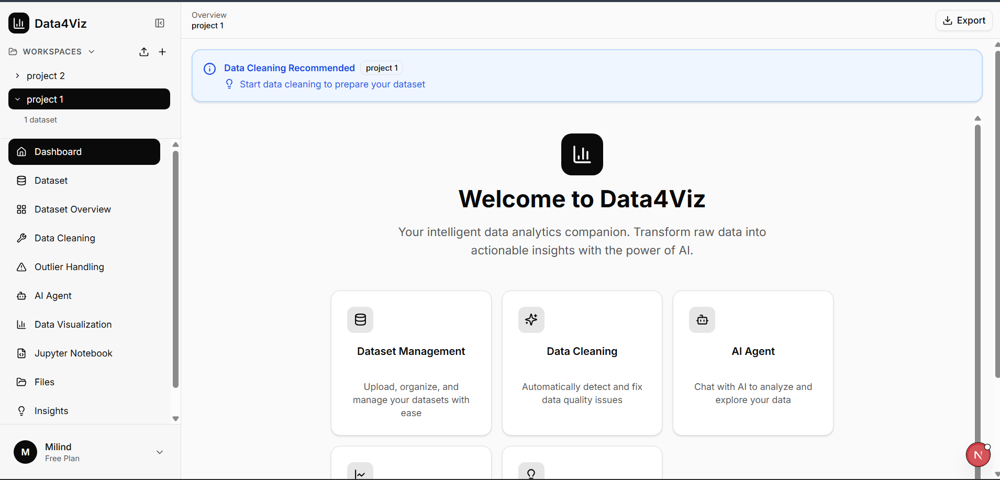
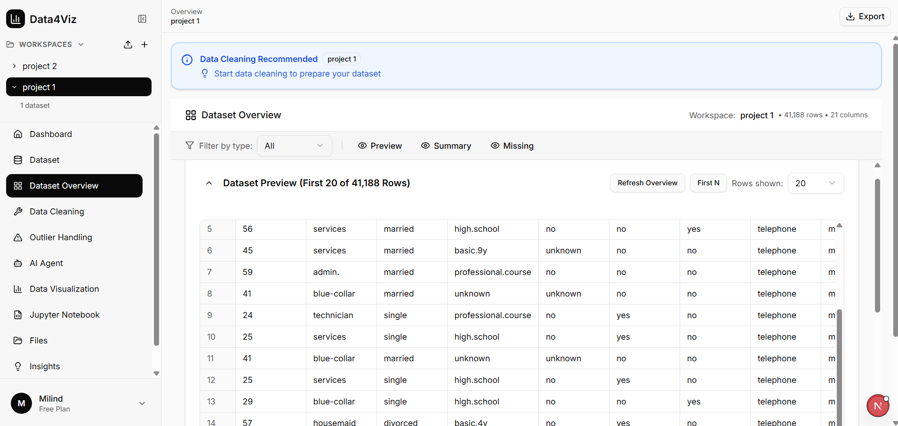
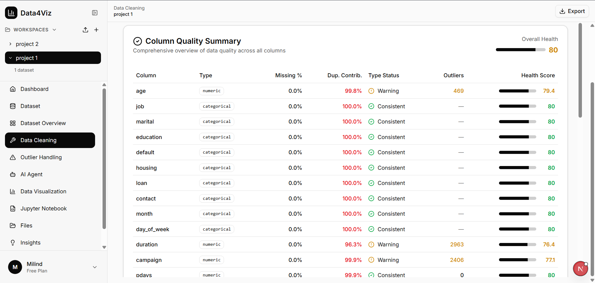
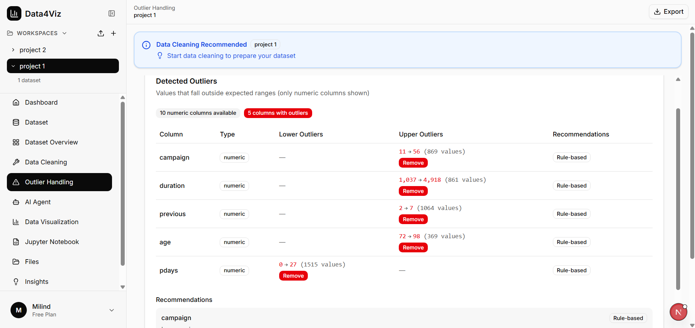
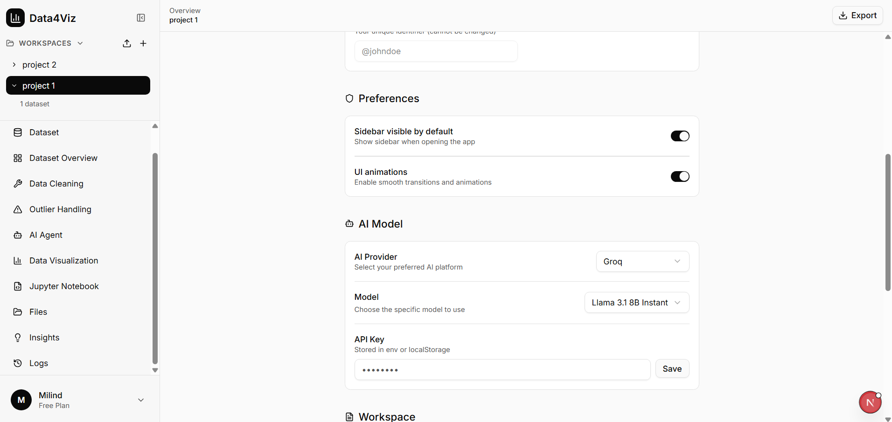

# 🚀 Data4Viz – AI Powered Data Analysis & Visualization Platform

An intelligent workspace for dataset profiling, cleaning, outlier detection,
and AI-driven exploratory data analysis.

---

## ✨ Platform Overview

Data4Viz simplifies the entire EDA workflow into a structured, interactive interface.

- 📂 Dataset Upload & Workspace Management
- 📊 Automatic Dataset Profiling
- 🧹 Column Quality & Cleaning Recommendations
- 🚨 Intelligent Outlier Detection
- 🤖 Built-in AI Agent for Analysis
- ⚙️ AI Model Configuration
- 📤 Export Capabilities

---

# 🏠 1️⃣ Home Dashboard

  

Centralized workspace to manage projects and datasets efficiently.

---

# 📂 2️⃣ Dataset Upload & Management

  

- Upload CSV files
- Load from public URL
- Automatic dataset registration
- Quick summarization

---

# 📊 3️⃣ Dataset Preview

  

- First N row preview
- Data type identification
- Structured table rendering

---

# 📈 4️⃣ Dataset Overview & Statistics

  

- Total rows & columns
- Numeric vs categorical breakdown
- Missing value detection
- Duplicate row detection
- DataFrame structural summary

Example case:
41,188 rows | 21 columns | 10 numeric | 11 categorical

---

# 🧹 5️⃣ Column Quality & Data Cleaning

  

- Column health scoring
- Duplicate contribution analysis
- Missing percentage tracking
- Data type validation
- Warning & consistency detection

---

# 🚨 6️⃣ Automated Outlier Detection

  

- Numeric column scanning
- Lower & upper bound detection
- Outlier count per column
- Rule-based removal recommendations

---

# ⚙️ 7️⃣ Preferences & AI Configuration

  

- UI behavior controls
- AI provider selection
- Model configuration
- API key management

---

# 🛠 Tech Stack

- Python
- Pandas
- Rule-Based Outlier Engine
- AI Model Integration (Groq / LLaMA)
- Interactive UI Framework

---

# 🎯 Problem It Solves

Traditional exploratory data analysis requires:

- Manual coding
- Multiple tools
- Repetitive preprocessing

Data4Viz centralizes and automates:

- Dataset profiling
- Cleaning diagnostics
- Outlier detection
- AI-driven insights

Significantly reducing EDA effort and time.

---

# 🔐 Source Code

Core implementation is private to protect intellectual property.  
Technical walkthrough available upon request.

---

# 👨‍💻 Author

Milind Chaudhari  
AI & Data Science Enthusiast
